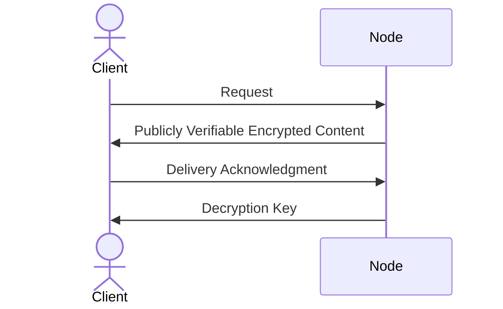

# Ursa Fair Delivery Protocol

> ℹ️ This internal document is aimed to be an initial draft of the said protocol, to gain review and
> comments from the team, and it is planned for this document to be transformed into the formal
> protocol description once the initial implementation is done and the reviews have happened.

Ursa's fair delivery protocol is a point to point protocol that different parties in Ursa use in order
to transfer content to a client.

In this version of the document we only focus on the cache node and the client, and leave the discussion
about the gateway for future, but essentially the gateway has the power to intercept the request and perform
some modifications to the data frames as it sees fit for the purposes of getting rewarded.

## Summary of the problem

Ursa is not like a traditional CDN, some of the biggest differences are 1) relying on a decentralized account
management, and 2) the decentralization of the nodes in the network which eliminates any trust assumptions
about the intentions of the said nodes.

Implementing a working and efficient CDN within these constraints has never been done before, for example the
integrity of the content being served is not guranteed in a naive implementation, luckily we don't have to deal
with that problem since we are used content addressability.

The next big problem is the decentralized account management which revolves around the delivery of content, how
do we ensure that the nodes running inside this network are getting paid for the work they do? And how do we charge
a client for the bandwidth they are using, without impacting the latency?

In the literature this problem is referred to as the **Fair Market Exchange** problem, which states that once an
exchange of goods between two parties is over, either no party should have received anything they wanted, or both
parties should be satisfied.

In our case the two parties are 1) the node, and 2) the client. They are exchanging payment for content.

## Solution

