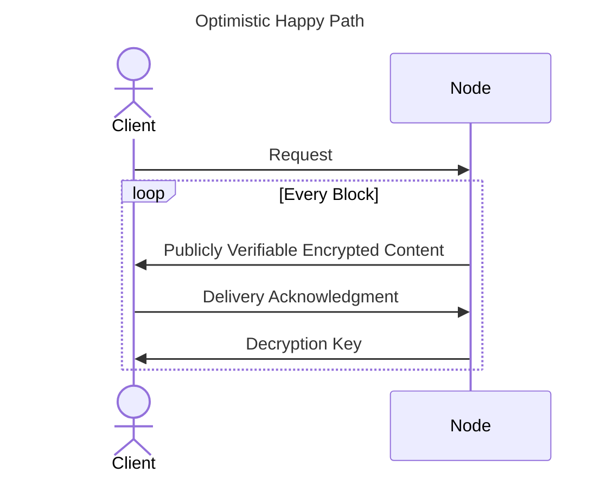
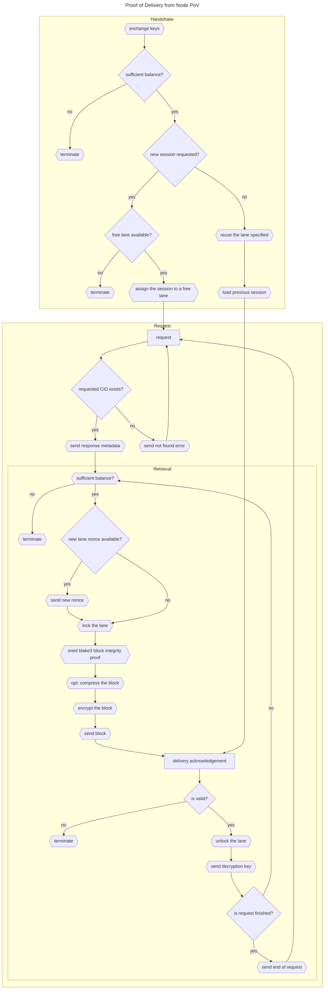

# Ursa Fair Delivery Protocol

> ℹ️ This internal document is aimed to be an initial draft of the said protocol, to gain review and
> comments from the team, and it is planned for this document to be transformed into the formal
> protocol description once the initial implementation is done and the reviews have happened.

Ursa's fair delivery protocol is a point-to-point protocol that different parties in Ursa use to transfer content to a client.

In this version of the document we only focus on the cache node and the client, and leave the discussion about the gateway for the future, but essentially the gateway has the power to intercept the request and perform
some modifications to the data frames as it sees fit for getting rewarded.

## Summary of the problem

Ursa is not like a traditional CDN, some of the biggest differences are 1) relying on a decentralized account management, and 2) the decentralization of the nodes in the network which eliminates any trust assumptions about the intentions of the said nodes.

Implementing a working and efficient CDN within these constraints has never been done before, for example, the integrity of the content being served is not guaranteed in a naive implementation, luckily we don't have to deal with that problem since we use content addressability.

The next big problem is the decentralized account management which revolves around the delivery of content, how do we ensure that the nodes running inside this network are getting paid for the work they do? And how do we charge a client for the bandwidth they are using, without impacting the latency?

In the literature, this problem is referred to as the **Fair Market Exchange** problem, which states that once an exchange of goods between two parties is over, either no party should have received anything they wanted, or both parties should be satisfied.

In our case the two parties are 1) the node, and 2) the client. They are exchanging payment for content.

## Solution



> 📝 You might have heard me using the term "Receipt of Payment" before, but now I'm using the term
> "Delivery Acknowledgment".

The above diagram depicts the main concept behind the solution, a node sends the encrypted response and only delivers the decryption key to the client once it receives the  *Delivery Acknowledgment* from the client.

And of course, you might naturally ask what if the node doesn't deliver the decryption key? Since the client can not unsend the "Delivery Acknowledgment" we have placed a slow path for the client to retrieve the decryption key from the committee.


## Algorithms

In this section, we will go through the algorithms used for different sections.

### Key Generation

#### Node

The node has an ephemeral private key for this protocol, which is shared with the committee using Shamir Secret Sharing at the beginning of each consensus epoch. We use curve SECP256K1, the private key is a random number $\alpha \in \mathbb{Z}$.

This private key is only used for delivery protocol and is refreshed every epoch. The public key obtained from this secret key should not be used to globally identify a node outside the epoch it was used at.

#### Client

Each client is identified by its public key, for clients we use BLS signatures, specifically the curve BLS12-381. This decision
is made to allow aggregation of the delivery acknowledgments when a node is sending the batch to the committee to claim its rewards.

### Request Info

The request info contains all of the information about a request that is taking place in the protocol, at a high level each request
is specific and unique per session and CID request, and the chunk index that is being served in the retrieval loop.

```rs
struct RequestInfo {
  cid: CID,
  node: Vec<secp256k1::AffinePoint>,
  client: bls::G1AffinePoint,
  session_nonce: [u8; 32],
}

struct RequestChunkInfo {
    info_hash: Blake3Digest<RequestInfo>,
    request_counter: u64,
    chunk_start: u64,
    chunk_end: u64,
}
```

#### Hash

> TBW: How to hash `RequestInfo` and `RequestChunkInfo` with blake3.

Summary: write everything to a buffer, use SEC-1 compressed encoding for public keys, and big-endian for numbers, in the same order we have the struct fields, and use two unique DST for `blake3::keyed_hash`.

#### Map to Curve

The map-to-curve functionality is used to map the `RequestChunkInfo` to a point on the SECP256K1 curve, this point is used to
drive the symmetric key used for the encryption and decryption phase, therefore it is important for this algorithm to be secure
and produces points on the curve with unknown discrete logarithm.

To achieve this we have adopted the IETF's [`Hashing to Elliptic Curves`](https://www.ietf.org/archive/id/draft-irtf-cfrg-hash-to-curve-16.html#name-hash_to_field-implementatio) standard, this standard specifies two methods to achieve this `encode_to_curve` and `hash_to_curve`. However, only `hash_to_curve` guarantees the uniform statistical distribution.

To implement `hash_to_field` we have chosen `blake3::hash_xof` as the expand message algorithm and we use `FLEEK_NETWORK_UFDP_HASH_TO_FIELD`
as the DST parameter.

### Block Encryption

Based on the requirements, we needed a very efficient cryptographically secure symmetric encryption, and since [128-bit security is sufficient](https://eprint.iacr.org/2019/1492.pdf) for our use case, the decision is to use  [HC-128](https://www.ecrypt.eu.org/stream/p3ciphers/hc/hc128_p3.pdf) which was found to perform the best during the benchmarks.

The `hc-128` cipher takes as an input one `128-bit` key and another `128-bit` IV, which is in total `256-bit`, we provide this input from a blake3 hash.

The hash function uses the globally defined and unique DST `FLEEK_NETWORK_UFDP_HASH_SYMMETRIC_KEY`, and we hash the compressed SEC1 encoding of the `AffinePoint` obtained by multiplying the ephemeral secret key of the node with the point which we have obtained in the previous step by hashing the `RequestChunkInfo` to the curve.

The following pseudo code can demonstrate:

```rs
const DST: &str = "FLEEK_NETWORK_UFDP_HASH_SYMMETRIC_KEY";
const BLAKE3_KEY: [u8; 32] = blake3::hash(DST);

let encryption_key = secret_key * RequestChunkInfo::hash_to_curve();
let encoded_point = encryption_key.to_affine().to_encoded_point(true);
let bytes = blake3::keyed_hash(BLAKE3_KEY, encoded_point.as_bytes());

let hc_key: [u8; 16] = bytes[0..16];
let hc_iv: [u8; 16] = bytes[16..32];
```

### Block Verification
### Block Decryption
### Generating Delivery Acknowledgments
### Verifying Delivery Acknowledgments

## Network Protocol



### Handshake
### Request
### Retrieve
### Lane

## Codec

Each request or response is prefixed by a frame tag and followed by the data as specified:

### Handshake Request

Client request to initiate a UFDP connection.

```
[ TAG . b"URSA" . version (1) . supported compression algorithm bitmap (1) . session lane . pubkey (48) ]
```
size: 56 bytes

Clients can optionally resume a previous lane in the event of a disconnection. To let the node select the lane automatically, the `lane` should be set to `0xFF`.

### Handshake Response

Node response to confirm a UFDP connection.

```
[ TAG . lane (1) . epoch nonce (8) . pubkey (32) ] [ 0x00 (1) || 0x80 (1) . u64 (8) . bls signature (96) ]
```
size: 44 bytes or 148 bytes

Node will set a lane if unspecified by the client, or reuse an existing lane, providing the last lane data (lane number, last received delivery acknowledgment).

### Content Request 

Client request for content

```
[ TAG . blake3hash (32) ]
```
size: 33 bytes

### Content Range Request 

Client request for a range of chunks of content

```
[ TAG . blake3hash (32) . u64 (8) . u16 (2) ]
```
size: 43 bytes

### Content Response

Node response for content.

The frame is always followed by the raw proof and content bytes.

```
[ TAG . compression (1) . proof length (8) . block length (8) . signature (64) ] [ proof .. ] [ content .. ]
```
size: 82 bytes + proof len (max 16KB) + content len (max 256KB)

### Decryption Key Request

Client request for a decryption key.

```
[ TAG . bls signature (96) ]
```
size: 97 bytes

The BLS signature, aka the delivery acknowledgment, is batched and submitted by the node for rewards.

### Decryption Key response

Node response for a decryption key.

```
[ TAG . decryption key (33) ]
```
size: 34 bytes

The client will use the key to decrypt and get the final block of data.

### Signals

Signals are a special type of frame that can be sent at any time. 
In most cases, signals are sent from the server to the client.

#### Update Epoch

Signal from the node an epoch has changed during a connection.

```
[ TAG . epoch nonce (8) ]
```
size: 9 bytes

Clients should sign the next delivery acknowledgments with this new epoch.

#### End of request

Signal from the node the request is finished and no more blocks will be sent

```
[ TAG ]
```
size: 1 byte

#### Termination

Signal from the node the connection was terminated, with a reason.

```
[ TAG . reason (1) ]
```
size: 2 bytes

